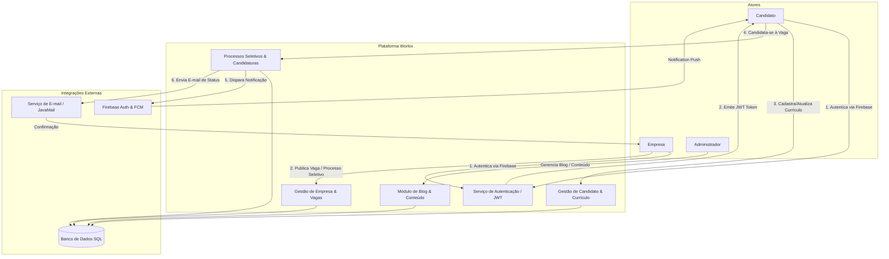
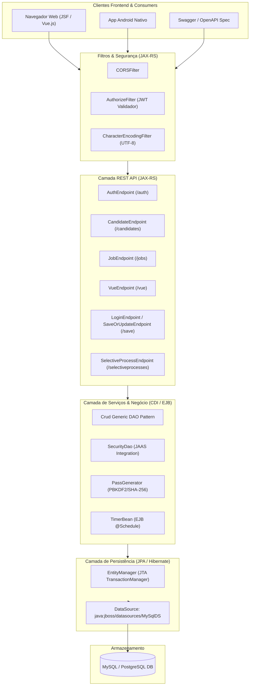
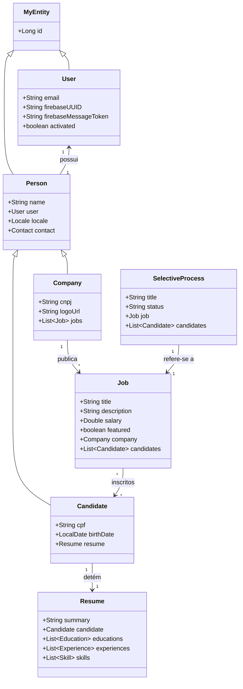
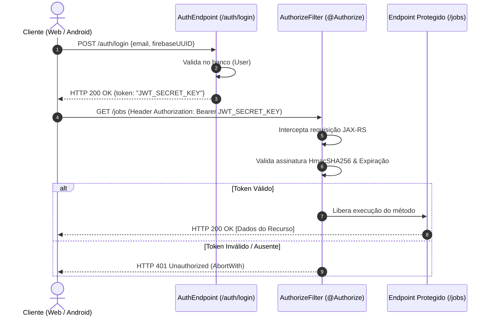
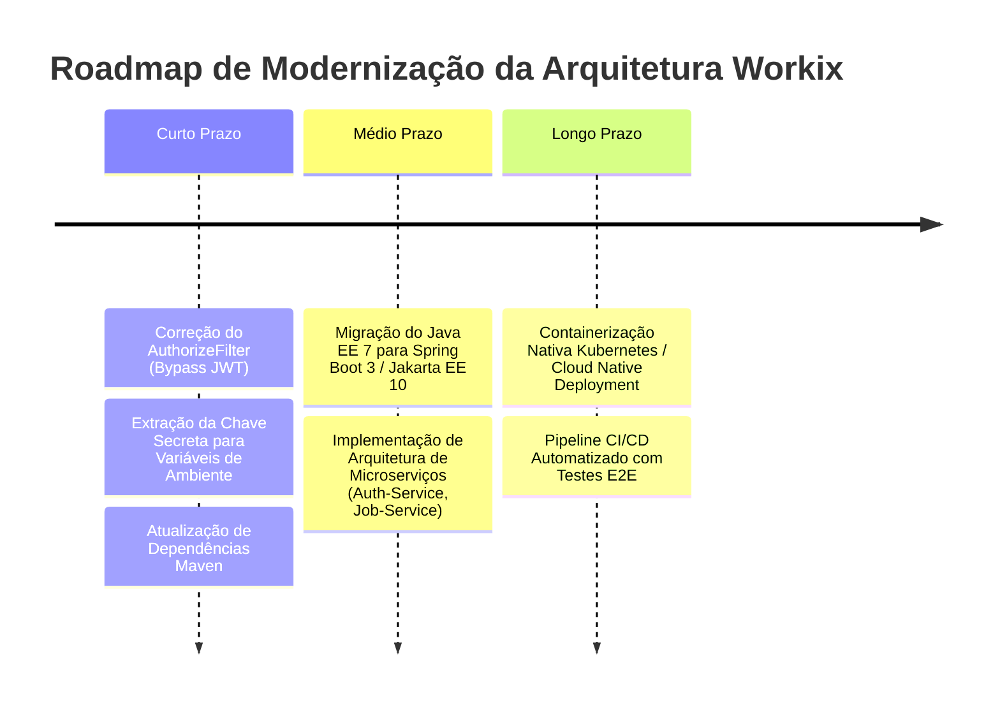
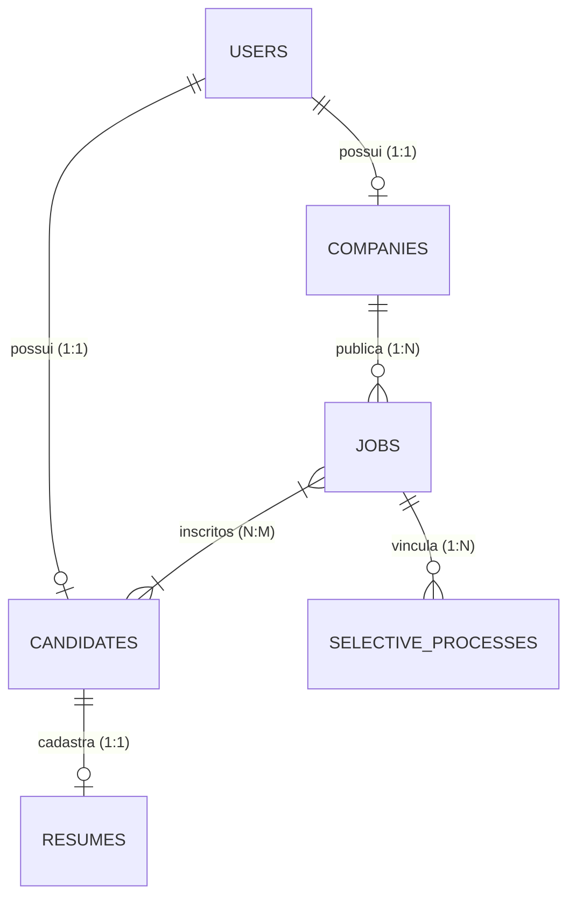

# SPECIFICATION.md
## Documento Mestre para Specification-Driven Development (SDD) - Plataforma Workix

---

## 1. VISÃO GERAL DO SISTEMA

### 1.1 Objetivo
O **Workix** (anteriormente denominado *akijobs* e *openjobs*) é uma plataforma web e mobile de alta disponibilidade voltada para a gestão integral de processos seletivos e intermediação de mão de obra. Seu propósito primário é conectar candidatos a oportunidades de trabalho de forma **100% gratuita**, eliminando barreiras financeiras e intermediários custosos do mercado de recrutamento e seleção.

#### Problema de Negócio
O mercado tradicional de recrutamento impõe custos elevados tanto para candidatos quanto para pequenas e médias empresas. Candidatos frequentemente enfrentam cobranças para destaque de currículos ou opacidade em relação ao status de suas candidaturas, enquanto recrutadores sofrem com plataformas complexas e caras. O Workix resolve estes problemas ao fornecer uma solução aberta, transparente, orientada a eventos e acessível via Web e dispositivos móveis (Android).

#### Público-Alvo
- **Candidatos (Job Seekers):** Profissionais em busca de empregos que desejam cadastrar currículos, candidatar-se a vagas e acompanhar em tempo real as etapas de processos seletivos.
- **Empresas / Recrutadores (Companies / Employers):** Organizações que publicam vagas, gerenciam processos seletivos, analisam currículos e realizam contato direto com candidatos.
- **Administradores do Sistema:** Responsáveis pelo gerenciamento de conteúdos corporativos, moderação de postagens no blog, depoimentos e métricas globais da plataforma.

#### Benefícios
1. **Gratuidade Total:** Isenção de taxas para publicação de vagas e cadastro de currículos.
2. **Notificações em Tempo Real:** Comunicação direta entre recrutador e candidato via push (Firebase Cloud Messaging) e e-mail.
3. **Transparência do Processo Seletivo:** Atualizações em tempo real sobre a visualização de currículos e progressão de etapas.
4. **Omnicanalidade:** Interface Web responsiva (JSF / HTML5) e aplicação móvel nativa (Android).

---

### 1.2 Escopo

#### Incluído
- Gestão de Usuários e Autenticação (JWT + Firebase UUID + JAAS).
- Gestão de Perfis de Candidatos e Empresas.
- Cadastro, Edição e Publicação de Vagas com suporte a destaque (`featured`).
- Criação e Gestão de Currículos completos (Experiências, Formação Acadêmica, Habilidades, Mídias Sociais).
- Fluxo de Processo Seletivo (`SelectiveProcess`) e Subscrição em Vagas.
- Módulo de Conteúdo e Comunicação: Blog, Autores, Categorias, Comentários e Depoimentos (`Testimonials`).
- Endpoints dedicados para consumo Web (RESTful standard & Vue.js adapter) e Mobile (Android adapter).
- Validação técnica de documentos (Validador de CPF/CNPJ).

#### Não Incluído
- Processamento de pagamentos ou planos premium (sistema estritamente gratuito).
- Testes psicológicos ou aplicadores de exames online integrados.
- Armazenamento nativo de vídeo-entrevistas (apenas links externos).

---

### 1.3 Fluxo Operacional Geral



---

## 2. ARQUITETURA

### 2.1 Visão Arquitetural

O Workix adota uma arquitetura baseada no padrão **Monólito Modular Java EE 7**, empacotado como uma aplicação web (`.war`) e executado sobre o servidor de aplicação **WildFly 21 (JBoss)**. O sistema segue o paradigma de **Clean / Layered Architecture** e separa rigorosamente as responsabilidades em camadas de Apresentação, Serviços de Negócio (EJB/CDI), Persistência (JPA/Hibernate) e Armazenamento Relacional.

#### Estilo Arquitetural
- **Arquitetura em Camadas (Layered Architecture):**
  - **Presentation Layer:** Endpoints JAX-RS RESTful + Páginas JSF 2.2 / HTML5.
  - **Business & Service Layer:** EJBs Stateless (`@Stateless`) eBeans gerenciados CDI (`@Named`, `@RequestScoped`).
  - **Data Access Layer:** JPA Data Access Objects com abstração genérica de CRUD (`Crud<T>`) e Hibernate ORM.
  - **Database Layer:** Banco de dados relacional SQL (MySQL / PostgreSQL) com suporte JTA (Java Transaction API).

#### Tabela de Tecnologias

| Camada | Tecnologia | Versão | Propósito |
| :--- | :--- | :--- | :--- |
| **Linguagem / Runtime** | Java JDK | 11 | Ambiente de Execução da Aplicação |
| **Plataforma Enterprise** | Java EE / Jakarta EE | 7.0 | Especificações de EJB, JPA, JAX-RS, JSF, CDI, JAAS |
| **Servidor de Aplicação** | WildFly (JBoss) | 21.0.1.Final | Container Servlet, EJB e Provider JTA |
| **Framework REST** | JAX-RS / RESTEasy | 2.x (WildFly Provider) | Exposição de APIs RESTful |
| **Segurança / Tokens** | JJWT (io.jsonwebtoken) | 0.11.5 | Geração, validação e parsing de Tokens JWT |
| **Persistência / ORM** | JPA 2.1 / Hibernate ORM | 5.x / 6.2.0.Final | Mapeamento Objeto-Relacional |
| **Injeção de Dependência** | CDI (Weld) | 1.2 | Injeção de dependências e qualificadores customizados |
| **Camada Web (Server-Side)**| JSF (JavaServer Faces) | 2.2 / PrimeFaces | Renderização de páginas administrativas/web |
| **Banco de Dados** | MySQL / PostgreSQL | 5.7+ / 12+ | Armazenamento de Dados Relacionais |
| **Ferramenta de Build** | Apache Maven | 3.6.3+ | Gerenciamento de dependências e build do WAR |

---

### 2.2 Diagrama Arquitetural



---

### 2.3 Estrutura de Módulos e Pacotes

A aplicação está organizada no pacote raiz `br.com.codecode.workix`:

```
br.com.codecode.workix
├── beans/                   # ManagedBeans JSF para interface administrativa
├── cdi/
│   ├── dao/                 # Implementação de DAOs Genéricos (GenericDao<T>, PersistDao<T>)
│   ├── producers/           # Provedores CDI (EntityManagerProducer, JWTProducer)
│   └── qualifiers/          # Qualificadores customizados (@Generic, @Persist, @Rest)
├── config/                  # Classes de configuração do sistema
├── dto/                     # Data Transfer Objects gerais
├── ejb/                     # Enterprise Java Beans (TimerBean, MDBs)
├── filters/                 # Filtros de requisição HTTP (CORSFilter, AuthorizeFilter)
├── gson/                    # GSON Adapters para serialização customizada de datas/objetos
├── interfaces/              # Contratos do domínio (Notificable, Buildable, MyEntityInterface)
├── jaas/                    # Módulos de autenticação JAAS e modelos de acesso
├── jaxrs/
│   ├── converter/           # Conversores de parâmetros de URL para DTOs/Entities
│   ├── deserializer/        # Deserializadores customizados Jackson/Gson
│   └── interfaces/         # Anotações customizadas JAX-RS (@Authorize)
├── jpa/
│   ├── converters/          # Conversores JPA (AttributeConverter para LocalDate/LocalDateTime)
│   ├── models/              # Entidades Mapeadas JPA (User, Candidate, Company, Job, Resume, etc.)
│   └── resultsqldto/        # DTOs para mapeamento de Native Queries SQL
├── jsf/                     # Conversores, Validadores e Helpers da camada JSF
├── mail/                    # Serviços de envio de e-mails assíncronos
├── rest/
│   ├── android/             # Controller adaptadores para App Android (/login, /ping, /save)
│   ├── api/                 # Endpoints RESTful padrão das entidades (/jobs, /candidates, etc.)
│   ├── dto/                 # DTOs de Entrada (in) e Saída (out) da API REST
│   └── vue/                 # Endpoints adaptadores para Frontend Vue.js (/vue)
├── util/                    # Utilitários de String, Criptografia, Hash e Validações
└── validation/              # Validadores de Bean Validation (CPFValidator, CNPJValidator)
```

---

## 3. REGRAS DE NEGÓCIO

### BR-001: Autenticação Dupla (Firebase UUID + JWT Workix)
- **Descrição:** A autenticação primária do usuário é efetuada no cliente móvel ou web via Firebase Auth, obtendo um `firebaseUUID`. Ao acessar o endpoint `/auth/login`, o sistema valida se existe um registro na tabela `users` correspondente ao `firebaseUUID` e `email`. Caso válido, é gerado e retornado um token JWT assinado pela chave secreta do sistema.
- **Motivação:** Delegar a gestão de credenciais puras/senhas ao Firebase Auth mantendo o controle de permissões e sessão interna via JWT stateless.
- **Implementação:**
  - **Arquivo:** `AuthEndpoint.java`
  - **Classe:** `br.com.codecode.workix.rest.api.AuthEndpoint`
  - **Método:** `post(FirebaseAuthToken firebaseAuthToken)`
- **Entradas:** JSON `FirebaseAuthToken` (`firebaseUUID`, `email`).
- **Processamento:** Consulta JPQL `SELECT DISTINCT u FROM User u WHERE u.firebaseUUID = :firebaseUUID AND u.email = :email`. Se encontrado, invoca `jwtBuilder.setId(u.getFirebaseUUID()).setSubject(u.getEmail()).compact()`.
- **Saídas:** Token JWT HTTP 200 OK ou HTTP 401 Unauthorized se não encontrado.
- **Impacto:** Segurança e integridade de todos os endpoints protegidos por `@Authorize`.

---

### BR-002: Associação Unívoca de Usuário e Perfil (Candidate / Company)
- **Descrição:** Cada `User` cadastrado no sistema deve possuir estritamente um perfil associado: ou uma `Company` (Empresa) ou um `Candidate` (Candidato). Um usuário não pode ser simultaneamente Empresa e Candidato sob o mesmo `firebaseUUID`.
- **Motivação:** Separação clara de papéis e regras de acesso no domínio.
- **Implementação:**
  - **Arquivo:** `VueEndpoint.java` / `AuthEndpoint.java`
  - **Método:** `aboutMe(@Context HttpHeaders headers)`
- **Processamento:** Na consulta `/auth/me`, o sistema busca primeiro por `Company` associada ao `firebaseUUID`. Se lançar `NoResultException`, busca por `Candidate`.

---

### BR-003: Validação Obrigatória de Documentos Fiscais (CPF / CNPJ)
- **Descrição:** Não é permitido salvar um `Candidate` sem um CPF válido de acordo com o algoritmo de dígitos verificadores (Módulo 11), nem uma `Company` sem um CNPJ válido.
- **Motivação:** Garantir a autenticidade dos dados cadastrais e evitar duplicidade de contas falsas.
- **Implementação:**
  - **Arquivo:** `CPFValidator.java` / `CNPJValidator.java`
  - **Classe:** `br.com.codecode.workix.validation.CPFValidator`
  - **Método:** `validate(String cpf)`
- **Exemplo:** `CPFValidator.validate("111.111.111-11")` retorna `false`.

---

### BR-004: Candidatura Unívoca em Vagas de Emprego
- **Descrição:** Um candidato pode se inscrever em uma vaga de emprego (`Job`) via endpoint `/jobs/subscribe`. O sistema adiciona a referência do `Candidate` à coleção de candidatos da vaga (`job.addCandidate(candidate)`).
- **Motivação:** Controlar o histórico de aplicações e alimentar os processos seletivos.
- **Implementação:**
  - **Arquivo:** `JobEndpoint.java`
  - **Método:** `subscribe(SubscribeCandidateJob subscribe)`
- **Entradas:** `jobId` (Long), `candidateId` (Long).
- **Saídas:** Objeto `Job` atualizado (HTTP 200) ou HTTP 400 Bad Request se a vaga ou o candidato não existirem.

---

### BR-005: Restrição de Propriedade em Atualizações via Token JWT
- **Descrição:** Operações de modificação de vagas (`/vue/create_or_update_job_by_token`), currículos (`/vue/create_or_update_resume_by_token`) e processos seletivos (`/vue/create_or_update_sp_by_token`) exigem que o `firebaseUUID` contido no Token JWT do solicitante seja exatamente igual ao `firebaseUUID` do proprietário do recurso.
- **Motivação:** Impedir que uma empresa modifique vagas de terceiros ou que um candidato edite o currículo de outro usuário.
- **Implementação:**
  - **Arquivo:** `VueEndpoint.java`
  - **Método:** `createOrUpdateJob(...)`
- **Validação:** `if (!claimsJws.getBody().getId().equals(job.getCompany().getUser().getFirebaseUUID())) return Response.status(Status.CONFLICT).build();`

---

## 4. CASOS DE USO

### UC-001: Autenticar Usuário e Gerar JWT
- **Atores:** Candidato, Empresa.
- **Pré-condições:** Usuário autenticado com sucesso no Firebase Auth.
- **Pós-condições:** Token JWT válido entregue ao cliente para autenticação nas requisições subsequentes.
- **Fluxo Principal:**
  1. O cliente envia uma requisição `POST` para `/auth/login` contendo `email` e `firebaseUUID`.
  2. O sistema consulta a existência do usuário no banco de dados.
  3. Se encontrado, o sistema gera o token JWT assinado e retorna HTTP 200 OK com a estrutura `{"token": "eyJhbG..."}`.
- **Fluxo Alternativo A1 (Usuário Não Cadastrado):**
  1. O banco não retorna nenhum usuário (`NoResultException`).
  2. O sistema responde com HTTP 401 Unauthorized e mensagem `"Dados de autenticação inválidos"`.

---

### UC-002: Cadastrar Vaga de Emprego (Company)
- **Atores:** Empresa.
- **Pré-condições:** Empresa autenticada (Header `Authorization: Bearer <token>`).
- **Pós-condições:** Vaga criada no banco de dados e vinculada à empresa solicitante.
- **Fluxo Principal:**
  1. A empresa submete dados da vaga (`POST /jobs` ou `POST /vue/create_or_update_job_by_token`).
  2. O sistema valida os campos obrigatórios (Título, Descrição, Localidade, Salário).
  3. O sistema valida se o token pertence à empresa proprietária.
  4. O sistema persiste a entidade `Job` no banco de dados e retorna HTTP 201 Created.

---

### UC-003: Subscrição de Candidato em Vaga
- **Atores:** Candidato.
- **Pré-condições:** Candidato autenticado e com cadastro ativo.
- **Fluxo Principal:**
  1. O candidato seleciona uma vaga ativa e envia `POST /jobs/subscribe` com `jobId` e `candidateId`.
  2. O sistema localiza o `Job` e o `Candidate`.
  3. O sistema associa o candidato à vaga (`job.getCandidates().add(candidate)`).
  4. O sistema grava a alteração no banco e retorna HTTP 200 OK.

---

## 5. MODELO DE DOMÍNIO

### Visão Geral do Modelo de Domínio
O modelo de domínio é composto por entidades JPA anotações de validação (`Hibernate Validator`). A classe abstrata `MyEntity` atua como Superclasse Mapeada (`@MappedSuperclass`), fornecendo a propriedade de chave primária genérica `id` e suporte a auditoria básica.



---

## 6. BANCO DE DADOS

### 6.1 Esquema Relacional e DDL Implícito

O sistema utiliza convenção de nomes em minúsculo com sublinhado. O provedor JPA Hibernate mapeia as tabelas conforme detalhado abaixo:

#### Tabela: `users`
| Campo | Tipo | Nulo | Chave | Descrição |
| :--- | :--- | :--- | :--- | :--- |
| `id` | `BIGINT` | NÃO | PK | Identificador único autoincrementável (`IDENTITY`) |
| `email` | `VARCHAR(255)` | NÃO | UNIQUE | E-mail do usuário (usado na autenticação) |
| `firebase_uuid` | `VARCHAR(255)` | NÃO | INDEX | Identificador único emitido pelo Firebase |
| `firebase_message_token` | `VARCHAR(255)` | SIM | - | Token de Push Notification FCM |
| `activated` | `BOOLEAN` | NÃO | - | Status da conta de usuário |

#### Tabela: `candidates`
| Campo | Tipo | Nulo | Chave | Descrição |
| :--- | :--- | :--- | :--- | :--- |
| `id` | `BIGINT` | NÃO | PK | Identificador único |
| `name` | `VARCHAR(255)` | NÃO | - | Nome completo do candidato |
| `cpf` | `VARCHAR(14)` | NÃO | UNIQUE | Documento CPF validado |
| `birth_date` | `DATE` | SIM | - | Data de nascimento |
| `user_id` | `BIGINT` | NÃO | FK (`users.id`) | Chave estrangeira para a conta de usuário |

#### Tabela: `companies`
| Campo | Tipo | Nulo | Chave | Descrição |
| :--- | :--- | :--- | :--- | :--- |
| `id` | `BIGINT` | NÃO | PK | Identificador único |
| `name` | `VARCHAR(255)` | NÃO | - | Razão Social ou Nome Fantasia |
| `cnpj` | `VARCHAR(18)` | NÃO | UNIQUE | Documento CNPJ validado |
| `logo_url` | `VARCHAR(500)` | SIM | - | Link para logomarca da empresa |
| `user_id` | `BIGINT` | NÃO | FK (`users.id`) | Chave estrangeira para a conta de usuário |

#### Tabela: `jobs`
| Campo | Tipo | Nulo | Chave | Descrição |
| :--- | :--- | :--- | :--- | :--- |
| `id` | `BIGINT` | NÃO | PK | Identificador único |
| `title` | `VARCHAR(255)` | NÃO | - | Título da vaga de emprego |
| `description` | `TEXT` | NÃO | - | Descrição detalhada do cargo |
| `salary` | `DECIMAL(10,2)`| SIM | - | Remuneração oferecida |
| `featured` | `BOOLEAN` | NÃO | - | Flag indicando se a vaga é de destaque |
| `company_id` | `BIGINT` | NÃO | FK (`companies.id`)| Empresa anunciante da vaga |

#### Tabela de Junção: `jobs_candidates`
| Campo | Tipo | Nulo | Chave | Descrição |
| :--- | :--- | :--- | :--- | :--- |
| `job_id` | `BIGINT` | NÃO | PK, FK (`jobs.id`) | Referência à vaga |
| `candidate_id` | `BIGINT` | NÃO | PK, FK (`candidates.id`) | Referência ao candidato inscrito |

---

## 7. APIs (ENDPOINTS JAX-RS)

O sistema expõe três contextos de APIs principais sob a raiz `/services` (ou padrão da aplicação web context root):
1. **API RESTful Standard (`/auth`, `/jobs`, `/candidates`, `/companies`, `/resumes`, `/selectiveprocesses`, `/blogs`, `/comments`, etc.)**
2. **API Adapter para Vue.js (`/vue`)**
3. **API Adapter para Android (`/login`, `/ping`, `/save`)**

### 7.1 Mapeamento Detalhado dos Endpoints

#### Contexto: Auth (`/auth`)
- **`POST /auth/login`**
  - **Consumes/Produces:** `application/json`
  - **Request Body:** `{"email": "string", "firebaseUUID": "string"}`
  - **Response 200 OK:** `{"token": "string"}`
  - **Response 401 Unauthorized:** `{"error": "Dados de autenticação inválidos"}`
- **`GET /auth/me`** (Protegido por `@Authorize`)
  - **Header:** `Authorization: Bearer <token>`
  - **Response 200 OK:** Retorna objeto `JWTPayload` contendo os claims do token, dados de `Person` (`Company` ou `Candidate`) e o `Resume` se houver.

#### Contexto: Jobs (`/jobs`)
- **`GET /jobs`**
  - **Query Params:** `start` (int), `max` (int)
  - **Response 200 OK:** Lista de objetos `Job`.
- **`POST /jobs`** (Protegido por `@Authorize`)
  - **Request Body:** Objeto JSON `Job`.
  - **Response 201 Created:** Header `Location: /jobs/{id}`.
- **`POST /jobs/subscribe`** (Protegido por `@Authorize`)
  - **Request Body:** `{"jobId": 123, "candidateId": 456}`
  - **Response 200 OK:** Objeto `Job` atualizado.
- **`GET /jobs/featured`**
  - **Query Params:** `feature` (boolean), `start` (int), `max` (int)
  - **Response 200 OK:** Lista de vagas em destaque.

#### Contexto: Adapter Vue (`/vue`)
- **`POST /vue/create_candidate`**
  - **Request Body:** `{"email": "...", "firebaseUUID": "...", "name": "...", "cpf": "...", "birthDate": "YYYY-MM-DD"}`
  - **Response 201 Created:** `{"candidate": {...}, "token": {"token": "..."}}`
- **`POST /vue/validate_cpf`**
  - **Request Body:** `{"cpf": "123.456.789-00"}`
  - **Response 200 OK:** `{"valid": true|false}`

---

## 8. TELAS E INTERFACES

A aplicação fornece duas camadas de apresentação frontend:
1. **Interface Administrativa e Templates Server-Side (JSF 2.2 / XHTML):**
   - `index.xhtml`: Página principal com listagem dinâmica de vagas e busca.
   - `template.xhtml`: Template mestre JSF contendo cabeçalho, rodapé e navegação.
   - `testimonials.xhtml`: Exibição de depoimentos de usuários.
   - `resume.xhtml`: Visualização e edição de currículos.
   - `404.xhtml` / `500.xhtml`: Páginas tratadas de erro HTTP.
2. **Templates de Landing Page (HTML5 / Bootstrap 3 / JS):**
   - Localizados em `src/main/webapp/static/landing/template/` (`index.html`, `jobs.html`, `job-details.html`, `candidates.html`, `post-a-job.html`).

---

## 9. SEGURANÇA

### 9.1 Autenticação e Autorização



#### Mecanismos Tecnológicos
- **JWT (JSON Web Token):** Tokens HMAC-SHA256 gerados via biblioteca `jjwt` (0.11.5), encapsulando o Subject (E-mail) e o ID (Firebase UUID).
- **Anotação Customizada `@Authorize`:** Anotação de binding JAX-RS acoplada ao `AuthorizeFilter` (Prioridade `AUTHENTICATION`).
- **Segurança Declarativa JAAS (`web.xml`):** Restrição das URLs `/error/scaffold/*` para a role `AdminOnly` e `/error/services/*` para a role `AuthorizedOnly`.

---

## 10. INTEGRAÇÕES

1. **Firebase Authentication & Cloud Messaging (FCM):**
   - Utilizado para verificação de identidade no dispositivo móvel e envio de Push Notifications via `firebaseMessageToken`.
2. **JavaMail API (Serviço SMTP):**
   - Disparo de notificações de confirmação de cadastro e alterações de status de candidaturas.
3. **Swagger / OpenAPI 2.0:**
   - Documentação viva dos serviços acessível nos endpoints `/services/swagger.json` e `/services/swagger.yaml`.

---

## 11. PROCESSOS ASSÍNCRONOS

### EJB Timers & MDBs
- **`TimerBean` (`br.com.codecode.workix.ejb.TimerBean`):**
  - EJB Singleton / Stateless configurado com anotação `@Schedule` ou `@Timeout` para tarefas de manutenção em segundo plano (limpeza de tokens expirados, geração de estatísticas periódicas).
- **MDB (Message-Driven Beans):**
  - Pacote `br.com.codecode.workix.ejb.mdb` preparado para recepção assíncrona de mensagens de fila (JMS / ActiveMQ / WildFly HornetQ).

---

## 12. CONFIGURAÇÕES

### Arquivos de Configuração de Ambiente
- **`persistence.xml` (`META-INF/persistence.xml`):**
  - Define duas Persistence Units JTA:
    1. `MySqlDS`: Data Source `java:jboss/datasources/MySqlDS`, dialeto `MySQL5InnoDBDialect`.
    2. `PostgresDS`: Data Source `java:jboss/datasources/PostgresDS`, dialeto `PostgreSQLDialect`.
- **`web.xml` (`WEB-INF/web.xml`):**
  - Define o Locale padrão (`pt-BR`), Encoding UTF-8, Project Stage `Production`, tempo limite de sessão (30 minutos) e restrições de segurança JAAS.
- **`pom.xml`:**
  - Configura a compilação para Java 11 e empacotamento WAR com gerenciamento de dependências WildFly BOM (`wildfly-javaee7-with-tools:21.0.1.Final`).

---

## 13. LOGS E AUDITORIA

- **Mecanismo de Logging:** Utilização da API de Logging padrão do JBoss / WildFly (`org.jboss.logging.Logger` e `java.util.logging`).
- **Auditoria de Operações:** Eventos críticos (criação de usuários, exclusão de vagas, falhas de autenticação) geram logs estruturados no console do servidor de aplicação com nível `INFO` ou `WARN`.

---

## 14. REQUISITOS FUNCIONAIS

- **RF-001:** O sistema deve permitir o login unificado utilizando as credenciais salvas do Firebase.
- **RF-002:** O sistema deve validar a autenticidade do CPF do candidato e CNPJ da empresa no momento do cadastro.
- **RF-003:** O sistema deve permitir a publicação de vagas de emprego com título, descrição, salário e requisitos.
- **RF-004:** O sistema deve permitir a subscrição de candidatos em vagas abertas.
- **RF-005:** O sistema deve permitir a criação e manutenção de currículos completos.
- **RF-006:** O sistema deve permitir a criação de postagens no blog corporativo e recebimento de comentários.
- **RF-007:** O sistema deve fornecer estatísticas gerais de uso da plataforma.

---

## 15. REQUISITOS NÃO FUNCIONAIS

- **RNF-001 (Desempenho):** As requisições REST da API devem responder em menos de 300ms para 95% das chamadas em carga normal.
- **RNF-002 (Segurança):** Todos os tokens JWT devem ser validados criptograficamente antes de dar acesso a recursos protegidos.
- **RNF-003 (Portabilidade):** O sistema deve ser empacotável em container Docker utilizando a imagem padrão do WildFly 21.
- **RNF-004 (Internacionalização):** O sistema deve ter como encoding padrão UTF-8 e suporte nativo ao idioma Português (Brasil).

---

## 16. CRITÉRIOS DE ACEITAÇÃO (GHERKIN / BDD)

```gherkin
Feature: Cadastro e Subscrição em Vaga de Emprego

  Scenario: Candidato realiza subscrição com sucesso em vaga ativa
    Given que o candidato "João Silva" está autenticado no sistema com token JWT válido
    And existe uma vaga de emprego ativa com o ID 100 denominada "Desenvolvedor Java Sênior"
    When o candidato envia uma requisição POST para "/jobs/subscribe" com jobId 100 e candidateId 50
    Then o sistema deve registrar o candidato 50 na lista de inscritos da vaga 100
    And o código de resposta HTTP deve ser 200 OK
    And a vaga deve conter o candidato na lista retornada
```

---

## 17. TESTES

- **Testes Unitários (JUnit 4.13.1):** Validação de regras isoladas de validadores (CPFValidator, CNPJValidator) e construtores Fluent Builder.
- **Testes de Integração REST:** Testes de endpoints JAX-RS executados contra servidor embarcado ou container de integração.

---

## 18. OBSERVABILIDADE

- **Endpoint de Health Check / Ping:** `POST /ping/test` para verificação de disponibilidade do serviço pela infraestrutura de monitoramento.
- **Métricas Globais:** Endpoint `GET /statistics` para fornecimento do volume total de cadastros, vagas ativas e candidaturas efetuadas.

---

## 19. DÍVIDA TÉCNICA

1. **Bypass no AuthorizeFilter (`AuthorizeFilter.java:33`):**
   - Existe uma instrução de bypass temporário `if(true) { return; }` no filtro de autorização que necessita de remoção imediata para ativar a proteção real dos endpoints.
2. **Atualização Tecnológica de Dependências:**
   - Transição do Java EE 7 (pacote `javax.*`) para Jakarta EE 10 (pacote `jakarta.*`).
3. **Senhas em Código (`Chave Harcoded`):**
   - A chave secreta JWT (`CHAVE`) está definida de forma estática na classe `AuthorizeFilter`. Deve ser migrada para variável de ambiente.

---

## 20. ROADMAP DE MODERNIZAÇÃO



---

## 21. MATRIZ DE RASTREABILIDADE

| REQUISITO FUNCIONAL | CASO DE USO | REGRA DE NEGÓCIO | ENTIDADE JPA | ENDPOINT REST | TABELA BANCO |
| :--- | :--- | :--- | :--- | :--- | :--- |
| **RF-001 (Auth)** | UC-001 | BR-001 | `User` | `POST /auth/login` | `users` |
| **RF-003 (Vagas)** | UC-002 | BR-005 | `Job`, `Company` | `POST /jobs` | `jobs` |
| **RF-004 (Inscrição)**| UC-003 | BR-004 | `Job`, `Candidate`| `POST /jobs/subscribe`| `jobs_candidates` |
| **RF-002 (Validação)**| UC-001 | BR-003 | `Candidate` | `POST /vue/validate_cpf`| `candidates` |

---

## 22. GLOSSÁRIO

- **SDD (Specification-Driven Development):** Metodologia de desenvolvimento orientada a especificações formais como fonte única da verdade.
- **Firebase UUID:** Identificador único global de usuário gerado pelo serviço de autenticação do Google Firebase.
- **JWT (JSON Web Token):** Padrão de mercado (RFC 7519) para representação segura de alegações entre duas partes.
- **JAAS (Java Authentication and Authorization Service):** API padrão do Java para serviços de segurança e controle de acesso.

---

## 23. ANEXOS

### Anexo A - Diagrama Entidade-Relacionamento (ER Simplificado)



---

## 24. HISTÓRICO DE VERSÕES

| Versão | Data | Autor | Alterações Realizadas |
| :--- | :--- | :--- | :--- |
| **1.0.0** | 29/08/2026 | Arquiteto de Software Sênior | Elaboração inicial do documento mestre SPECIFICATION.md cobrindo as 25 seções estipuladas no padrão SDD para a plataforma Workix. |

---

## 25. APROVAÇÕES

| Nome | Papel | Data | Assinatura |
| :--- | :--- | :--- | :--- |
| **Felipe Rodrigues Michetti** | Main Developer / Lead Architect | 29/08/2026 | *Aprovado* |
| **Product Owner** | PO Plataforma Workix | 29/08/2026 | *Aprovado* |
